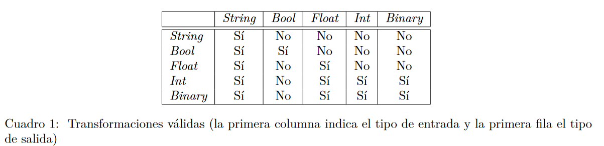
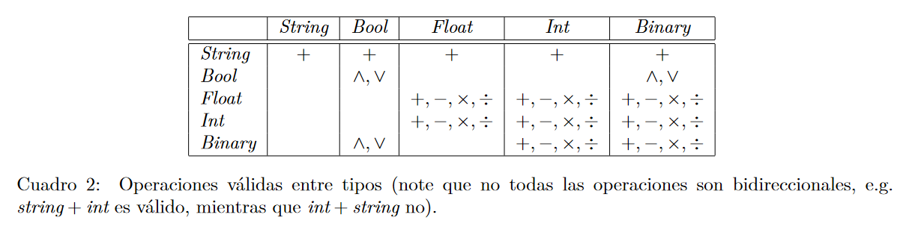
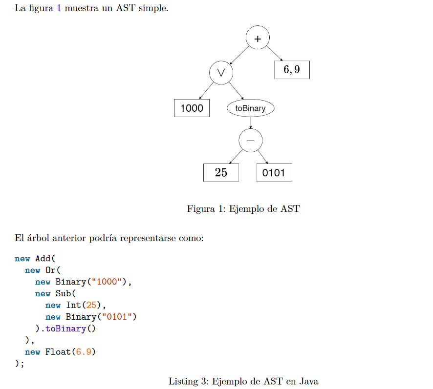

# cl.uchile.dcc.scrabble.model.ScrabbleTypes

Interactive graphic programming language heavily inspired by 
[Scratch](https://scratch.mit.edu).
This work is licensed under a
[Creative Commons Attribution 4.0 International License](http://creativecommons.org/licenses/by/4.0/), 
and aims purely to be used with the purpose of teaching in the context of the course 
_CC3002 Metodologías de Diseño y programación_ of the 
[_Computer Sciences Department (DCC)_](https://www.dcc.uchile.cl) of the 
_University of Chile_.

---

# Scrabble
An interactive program created to emulate operations and the correct use of different data types availables in porgramming languages. Perfect for people starting coding or students.

# Logic
In this scenario we will emulate five different Data Types: *String*, *Bool*, *Int*, *Float* and *Binary*. 
Since the program is in Java each type will be represented by a native data type from Java, the representations are as follows:
- **String**: a Java String.
- **Bool**: a boolean.
- **Float**: a double.
- **Int**: an Int.
- **Binary**: a 32bit Binary as a Java String.

This types can interact with each other and be transformed when necessary, but only the following transformations will be allowed:

The same way, operations between this types will have restrictions:

> **Note**: **Negation** is not mentioned. **Negation** can only be aplied to *Logical* *Types* as **Binary** or **Boolean**.+

Finally, each equation created in the App will be seen as a tree and handled in the same way. Example:

# Program
Specs:
- A **Maven** project
- **Java** Version: Azul-15.0.3
- **JavaFX** Version: 15.0.1
- Tests made with **Junit-Jupiter** -version 5.8.0-M1
- Idle: **Intellij** 2020.3.3

The program was designed with the design patern view-model-controller. It is easy to find each part divided in its own package within /src/main/java/cl/uchile/dcc/scrabble: "gui", "model" and "controller" respectively.
The whole project was made with Intellij and it is recommended to run the files within the same program. To run Scrabble do the following instructions:
- Open "*ScrabbleApp*" Java Class
	> You will find the file at: /src/main/java/cl/uchile/dcc/scrabble/gui
	
- Run the program with IntelliJ

- At the StartWindow just press the "Start" button and explore the App!
# Application
**START**
- To start using the **Scrabble** **App** just press "**START**" in the main window, this will open the calculator ready to use.

- The *App* will guide you, and invite you to do a correct use of the calculator. The first thing you will see, are all the buttons with the available *Operations* and *Transformations*, select the desired path to follow and you will start writting your first equation.
	> **Note**: If you are wondering why you start selecting the *Operations* and/or *Transformations* first instead of a Data Type, go to the **Logic Section** and check the tree representation and the pseudo code to understand what type of equation you will be writting in this calculator. Alternatively, just press any button and see it by yourself!

**USING THE CALCULATOR**
- If you check at the top, the Scrabble calculator will show you in each step what are you currently calculating.
- In this part you will be free to writte any equation you want, but be aware that the Scrabble Calculator follows all the restrictions mentioned at the **Logic Section**. (Go check the restrictions to avoid invalid equations).
	>**Note**: In case you writte an invalid equation, the calculator will not give you a result.
- In case you make a mistake, do not worry! Just press the "***Clear Button***" at your bottom left corner, to have a fresh start again.

**INTELLIGENT ASSISTANCE**
To help you as much as we can, we created certain functionalities that will tell you if you are doing things right.
- The first thing you will notice, is that there is no button to get a result, but dont be alarmed. The ***CALCULATE BUTTON*** will only appear once you have a completed *Operation* or *Transformation* in your input, this will avoid that you calculate something without a Data Type in the first place.
- Just under the *Output* *Label* you will notice a "***View as an Equation Button***", press this if you prefer to see your equation in a conventional way.
	>**Note**: We recommend to use this view when your equation is completed since the easier way to understand what are you giving as an input is the *Pseudo*-*Code* form.
- Finally, for each Data Type we created a personalized input window, so it will be very intuitive for everyone to know what they are doing. We invite you to try them by yourselves!

**Enjoy the Scrabble Calculator :)**
